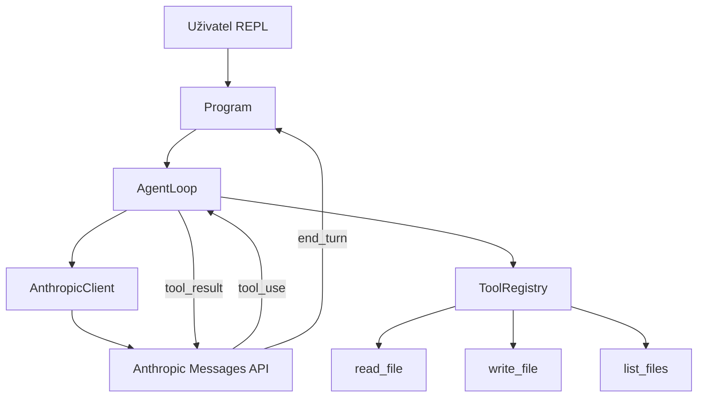

# ClaudeAgent — Dokumentace

Konzolová aplikace v .NET 10 demonstrující agentní smyčku s Claude (Anthropic API).

## Struktura repozitáře

```
ClaudeAgent/
├── src/
│   └── ClaudeAgent/          # Hlavní aplikace
│       ├── Program.cs        # REPL vstupní bod
│       ├── AnthropicClient.cs
│       ├── AgentLoop.cs
│       ├── Models/
│       └── Tools/
├── tests/
│   └── ClaudeAgent.Tests/    # Unit testy (xUnit)
├── docs/                     # Dokumentace projektu
├── ClaudeAgent.sln
└── README.md                 # Zadání a specifikace
```

## Architektura



## Komponenty

### AnthropicClient

Přímé HTTP volání endpointu `POST https://api.anthropic.com/v1/messages` bez externího SDK.
Serializace probíhá přes `System.Text.Json` s vlastním konvertorem pro pole `Message.content`.

### AgentLoop

Implementuje smyčku tool calling:

1. Odešle zprávy na API včetně definic nástrojů
2. Při `stop_reason == "tool_use"` vykoná lokální nástroje a přidá `tool_result`
3. Při `stop_reason == "end_turn"` vrátí textovou odpověď

### Nástroje (Tools)

| Nástroj | Účel | Omezení |
|---------|------|---------|
| `read_file` | Čtení textového souboru | Max 100 KB, bez binárních dat |
| `write_file` | Zápis textového souboru | Vytvoří adresáře v cestě |
| `list_files` | Výpis souborů v adresáři | Volitelný glob pattern |

## Spuštění

### Požadavky

- .NET 10 SDK nebo novější
- Environment proměnná `ANTHROPIC_API_KEY`

### Build a run

```bash
export ANTHROPIC_API_KEY="sk-ant-..."
dotnet run --project src/ClaudeAgent
```

### Testy

```bash
dotnet test
```

## Konfigurace

Konfigurace se skládá z `appsettings.json`, lokálního override a proměnných prostředí (přes `Microsoft.Extensions.Configuration`). Podrobnosti viz [`docs/configuration.md`](configuration.md).

| Parametr | Zdroj | Výchozí hodnota |
|----------|-------|-----------------|
| API klíč | `ANTHROPIC_API_KEY` (jen env, secret) | — (povinné) |
| Model | `appsettings.json` / env | `claude-sonnet-4-6` |
| max_tokens | `appsettings.json` / env | `8096` |
| max iterací nástrojů | `appsettings.json` / env | `25` |
| workspace | `appsettings.json` / env | aktuální adresář |

## REPL příkazy

| Příkaz | Popis |
|--------|-------|
| `exit` | Ukončí aplikaci |
| `clear` | Resetuje historii konverzace |
| `help` | Zobrazí nápovědu |
| libovolný text | Odešle zprávu agentovi |

## Rozšíření (backlog)

Viz tabulku v `README.md` — plánované featury zahrnují `execute_command`, logování a streaming. Konfigurace přes `appsettings.json` je již hotová (viz [`docs/configuration.md`](configuration.md)).
