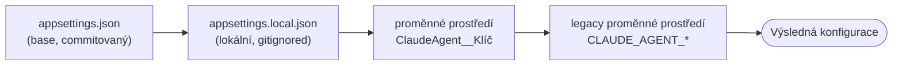

# ClaudeAgent — Konfigurace

Tento dokument popisuje, jak se ClaudeAgent CLI konfiguruje: konfigurační soubory, proměnné prostředí, jejich priority a bezpečné zacházení s API klíčem.

Konfigurace stojí na knihovně **`Microsoft.Extensions.Configuration`** — hodnoty se skládají z více vrstev, přičemž pozdější vrstva přepisuje dřívější.

## Vrstvy a priorita

Hodnoty se načítají v tomto pořadí (každá další **přepisuje** předchozí):



| Priorita | Zdroj | Poznámka |
|----------|-------|----------|
| 1 (nejnižší) | `appsettings.json` | Základ commitovaný v repu, bez secretů |
| 2 | `appsettings.local.json` | Lokální override, **gitignored** |
| 3 | proměnné prostředí `ClaudeAgent__Klíč` | Standardní .NET mapování (dvojité podtržítko) |
| 4 (nejvyšší) | legacy proměnné prostředí `CLAUDE_AGENT_*` | Zpětná kompatibilita |

## Parametry

Všechny parametry žijí v sekci `ClaudeAgent`.

| Parametr | Typ | Výchozí | appsettings klíč | Standardní env | Legacy env |
|----------|-----|---------|------------------|----------------|------------|
| Model | string | `claude-sonnet-4-6` | `ClaudeAgent:Model` | `ClaudeAgent__Model` | — |
| Max. tokenů odpovědi | int | `8096` | `ClaudeAgent:MaxTokens` | `ClaudeAgent__MaxTokens` | — |
| Max. iterací nástrojů | int | `25` | `ClaudeAgent:MaxToolIterations` | `ClaudeAgent__MaxToolIterations` | `CLAUDE_AGENT_MAX_ITERATIONS` |
| Pracovní adresář (workspace) | string | aktuální adresář | `ClaudeAgent:Workspace` | `ClaudeAgent__Workspace` | `CLAUDE_AGENT_WORKSPACE` |
| **API klíč** | string | — (povinné) | **nepoužívá se** | — | `ANTHROPIC_API_KEY` |

> [!NOTE]
> Nekladná hodnota u `MaxTokens` nebo `MaxToolIterations` se ignoruje — aplikace vypíše varování a použije výchozí hodnotu.

## appsettings.json

Základní konfigurace je v [`src/ClaudeAgent/appsettings.json`](../src/ClaudeAgent/appsettings.json) a kopíruje se k binárce při buildu:

```json
{
  "ClaudeAgent": {
    "Model": "claude-sonnet-4-6",
    "MaxTokens": 8096,
    "MaxToolIterations": 25,
    "Workspace": ""
  }
}
```

Prázdný `Workspace` znamená aktuální adresář, odkud je aplikace spuštěna. Soubor podporuje `//` komentáře.

## Lokální override (appsettings.local.json)

Pro lokální nastavení bez zásahu do commitovaného souboru vytvořte vedle `appsettings.json` soubor `appsettings.local.json`. Je v [`.gitignore`](../.gitignore), takže se necommituje, a kopíruje se k binárce jen pokud existuje:

```json
{
  "ClaudeAgent": {
    "Model": "claude-haiku-4-5-20251001",
    "MaxToolIterations": 10
  }
}
```

## Proměnné prostředí

### Standardní (doporučené)

.NET mapuje vnoření sekcí přes dvojité podtržítko `__`:

```powershell
# PowerShell
$env:ClaudeAgent__Model = "claude-haiku-4-5-20251001"
$env:ClaudeAgent__MaxTokens = "4096"
```

```bash
# bash
export ClaudeAgent__Model="claude-haiku-4-5-20251001"
export ClaudeAgent__MaxTokens="4096"
```

### Legacy (zpětná kompatibilita)

Původní názvy proměnných nadále fungují a mají **nejvyšší** prioritu:

| Legacy proměnná | Mapuje se na |
|-----------------|--------------|
| `CLAUDE_AGENT_WORKSPACE` | `ClaudeAgent:Workspace` |
| `CLAUDE_AGENT_MAX_ITERATIONS` | `ClaudeAgent:MaxToolIterations` |

## API klíč a bezpečnost

> [!IMPORTANT]
> **API klíč je secret a načítá se výhradně z proměnné prostředí `ANTHROPIC_API_KEY`.**
> Záměrně **není** součástí `appsettings.json` ani třídy `AgentSettings`, aby se předešlo nechtěnému commitnutí citlivého údaje do repozitáře. Pokud klíč není nastaven, aplikace vypíše chybu a skončí.

```powershell
# PowerShell
$env:ANTHROPIC_API_KEY = "<vas-api-klic>"
dotnet run --project src/ClaudeAgent
```

```bash
# bash
export ANTHROPIC_API_KEY="<vas-api-klic>"
dotnet run --project src/ClaudeAgent
```

## Implementace

| Soubor | Účel |
|--------|------|
| [`Configuration/AgentSettings.cs`](../src/ClaudeAgent/Configuration/AgentSettings.cs) | POCO s konfiguračními hodnotami a výchozími hodnotami |
| [`Configuration/AgentConfiguration.cs`](../src/ClaudeAgent/Configuration/AgentConfiguration.cs) | Skládání vrstev (`Load`), binding (`Bind`) a legacy mapování (`BuildLegacyOverrides`) |
| [`Program.cs`](../src/ClaudeAgent/Program.cs) | Načtení konfigurace při startu a předání do `AgentLoop` |

Výchozí hodnoty jsou centralizované jako konstanty v [`AgentLoop`](../src/ClaudeAgent/AgentLoop.cs) (`DefaultModel`, `DefaultMaxTokens`, `DefaultMaxToolIterations`).
